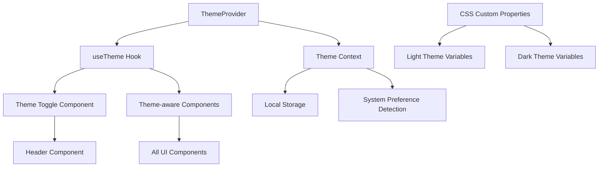

# Dark Mode Support Design Document

## Overview

This design implements a comprehensive dark mode system for the personal portfolio website using React Context, custom hooks, and CSS custom properties. The system provides seamless theme switching with persistence, accessibility compliance, and integration with the existing Tailwind CSS setup.

## Architecture

### Theme System Architecture



### State Management Flow

1. **Initialization**: ThemeProvider detects system preference or loads saved preference
2. **User Interaction**: Theme toggle triggers theme change
3. **State Update**: Context updates theme state and persists to localStorage
4. **UI Update**: CSS custom properties update, triggering visual changes
5. **Persistence**: Theme preference saved for future visits

## Components and Interfaces

### Core Theme Components

#### ThemeProvider
- **Location**: `src/contexts/ThemeContext.tsx`
- **Purpose**: Manages global theme state and provides context to child components
- **Props**: `{ children: React.ReactNode }`
- **State**: Current theme, system preference, loading state

#### ThemeToggle
- **Location**: `src/components/ui/ThemeToggle.tsx`
- **Purpose**: UI component for switching between light and dark themes
- **Features**: Icon animation, keyboard accessibility, ARIA labels
- **Integration**: Embedded in Header component

#### useTheme Hook
- **Location**: `src/hooks/useTheme.ts`
- **Purpose**: Provides theme state and actions to components
- **Returns**: `{ theme, toggleTheme, systemPreference, isLoading }`

### TypeScript Interfaces

```typescript
// Theme types
export type Theme = 'light' | 'dark' | 'system';
export type ResolvedTheme = 'light' | 'dark';

// Theme context interface
export interface ThemeContextType {
  theme: Theme;
  resolvedTheme: ResolvedTheme;
  setTheme: (theme: Theme) => void;
  toggleTheme: () => void;
  systemPreference: ResolvedTheme;
  isLoading: boolean;
}

// Theme toggle props
export interface ThemeToggleProps {
  size?: 'sm' | 'md' | 'lg';
  showLabel?: boolean;
  className?: string;
}
```

## Data Models

### Theme Configuration

```typescript
// Theme configuration object
export const themeConfig = {
  storageKey: 'portfolio-theme-preference',
  defaultTheme: 'system' as Theme,
  themes: ['light', 'dark', 'system'] as const,
  transitionDuration: '200ms',
} as const;

// CSS custom properties mapping
export const cssVariables = {
  light: {
    '--color-background': '#ffffff',
    '--color-foreground': '#171717',
    '--color-primary': '#3b82f6',
    '--color-secondary': '#6b7280',
    '--color-accent': '#f3f4f6',
    '--color-border': '#e5e7eb',
    '--color-muted': '#9ca3af',
  },
  dark: {
    '--color-background': '#0a0a0a',
    '--color-foreground': '#ededed',
    '--color-primary': '#60a5fa',
    '--color-secondary': '#9ca3af',
    '--color-accent': '#1f2937',
    '--color-border': '#374151',
    '--color-muted': '#6b7280',
  },
} as const;
```

### Local Storage Schema

```typescript
// Stored theme preference
interface StoredThemePreference {
  theme: Theme;
  timestamp: number;
  version: string; // For future migration compatibility
}
```

## Error Handling

### Graceful Degradation Strategy

1. **localStorage Unavailable**: Fall back to system preference detection
2. **System Preference Unavailable**: Default to light theme
3. **Invalid Stored Value**: Reset to system preference and clear storage
4. **Context Not Available**: Provide default theme values with warning

### Error Boundaries

```typescript
// Theme error boundary for isolated failures
export class ThemeErrorBoundary extends React.Component {
  // Catches theme-related errors and provides fallback UI
  // Logs errors for debugging while maintaining functionality
}
```

### Validation Functions

```typescript
// Theme validation utilities
export const validateTheme = (value: unknown): Theme | null => {
  // Validates theme values from storage or props
};

export const validateStoredPreference = (
  stored: unknown
): StoredThemePreference | null => {
  // Validates and migrates stored preferences
};
```

## Testing Strategy

### Unit Tests

1. **ThemeProvider Tests**
   - Initial theme detection (system/stored preference)
   - Theme switching functionality
   - localStorage integration
   - Error handling scenarios

2. **useTheme Hook Tests**
   - Hook return values
   - Theme toggle behavior
   - System preference changes
   - Loading states

3. **ThemeToggle Component Tests**
   - Rendering in different themes
   - Click and keyboard interactions
   - Accessibility attributes
   - Icon state changes

### Integration Tests

1. **Theme Persistence Tests**
   - Theme preference saving/loading
   - Cross-session persistence
   - Storage error handling

2. **System Integration Tests**
   - System preference detection
   - Preference change handling
   - Media query integration

### Accessibility Tests

1. **WCAG Compliance Tests**
   - Color contrast ratios in both themes
   - Focus indicators visibility
   - Screen reader compatibility
   - Keyboard navigation

2. **User Preference Tests**
   - Reduced motion respect
   - High contrast mode support
   - System theme synchronization

### Visual Regression Tests

1. **Component Theme Tests**
   - All components in light theme
   - All components in dark theme
   - Theme transition animations
   - Cross-browser compatibility

## Implementation Phases

### Phase 1: Core Theme System
- ThemeProvider and Context setup
- useTheme hook implementation
- Basic CSS custom properties
- System preference detection

### Phase 2: UI Components
- ThemeToggle component
- Header integration
- Basic theme switching functionality
- localStorage persistence

### Phase 3: Styling Integration
- Update all components for theme support
- Comprehensive CSS variable system
- Tailwind CSS integration
- Animation and transition polish

### Phase 4: Accessibility & Testing
- WCAG compliance verification
- Comprehensive test suite
- Error handling refinement
- Performance optimization

## Integration Points

### Tailwind CSS Integration

```typescript
// Tailwind config extension for theme support
module.exports = {
  theme: {
    extend: {
      colors: {
        background: 'var(--color-background)',
        foreground: 'var(--color-foreground)',
        primary: 'var(--color-primary)',
        // ... other theme colors
      },
    },
  },
  // Dark mode configuration
  darkMode: 'class',
};
```

### Next.js Integration

- Server-side rendering considerations
- Hydration mismatch prevention
- Static generation compatibility
- Performance optimization

### Existing Component Updates

- Header component theme toggle integration
- All UI components theme-aware styling
- Layout components background/foreground updates
- Form components theme consistency